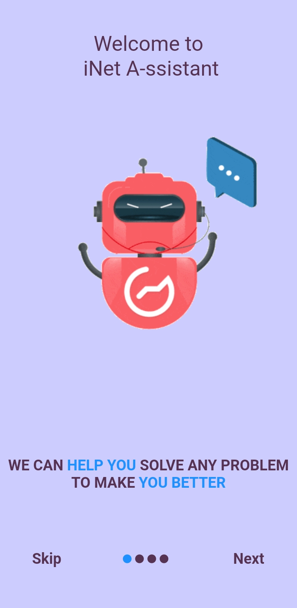
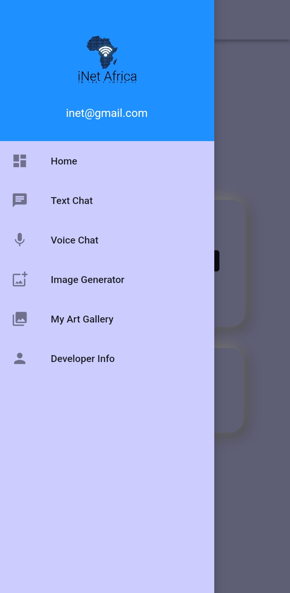
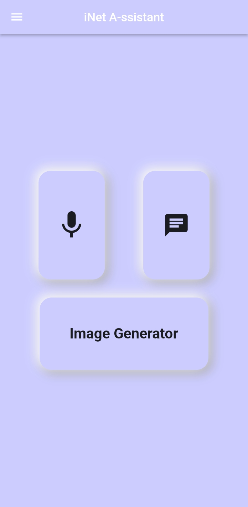
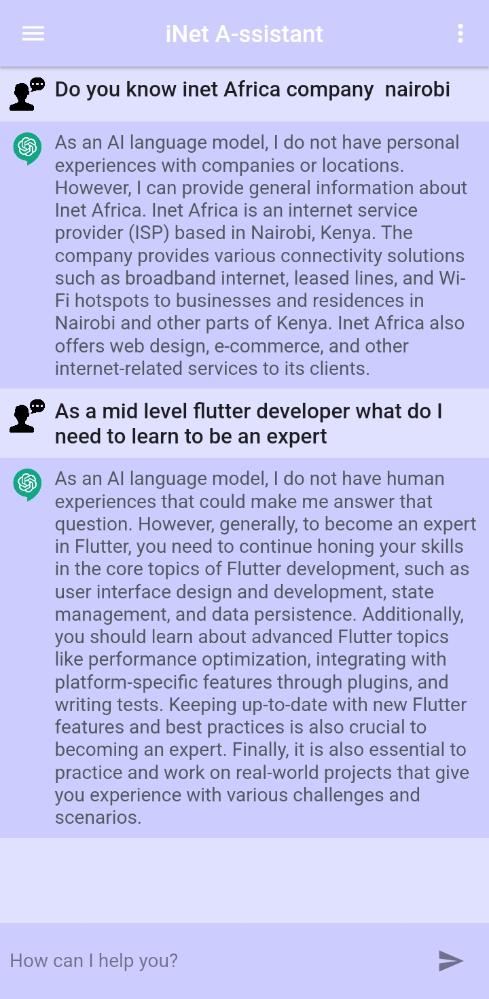
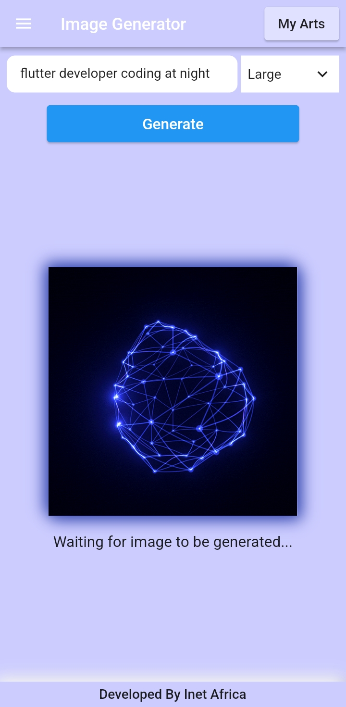
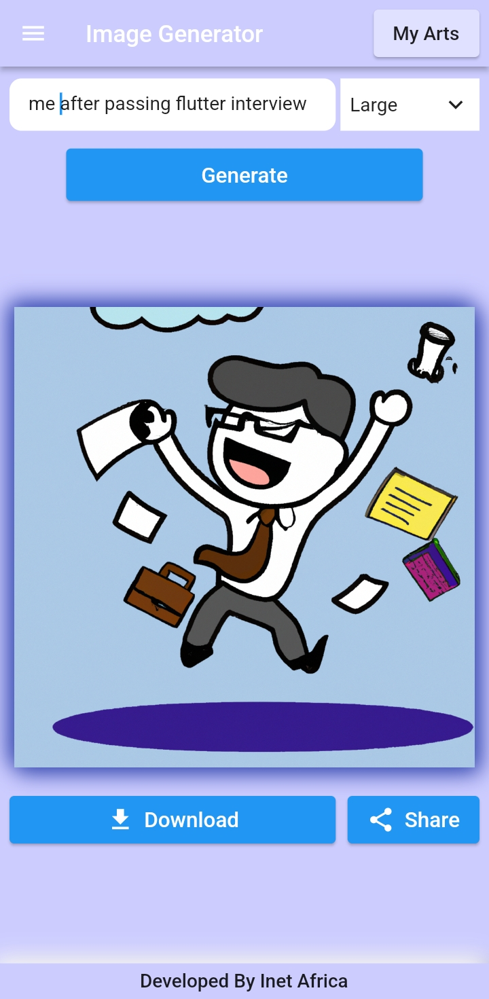
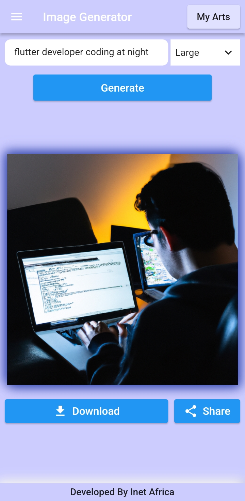

# Inet A-ssistant 

Elegant & minimal voice & text chat app assistant.It has additional AI Image generator.The chat fuctionalities is powered bay OpenAi ChatGPT.

(Requires Android 6.0 or later)

## SreenShots

      

## Features

- :white_check_mark: Beautiful,Simple & Minimal UI
- :white_check_mark: ChatGPT Powered Voice Chat Assistant
- :white_check_mark: ChatGPT Powered Text Chat Assistant
- :white_check_mark: OpenAi davinci  Powered Image Generator

## Download

Download [here](https://github.com/gibeongideon/inetChatbot/releases) or get it on `PlayStore`

## Future work & Features to add

- i18n support for multiple languages
- Add user login after onboarding
- Add subscription to monetize the app
- Switch from provider state management to Bloc state management
- Optimize and refuctor the code to minimize code base

## Acknowledgments

- [OpenAi Icon](url)
- [App Mockup](https://app-mockup.com), [photopea](http://photopea.com)
